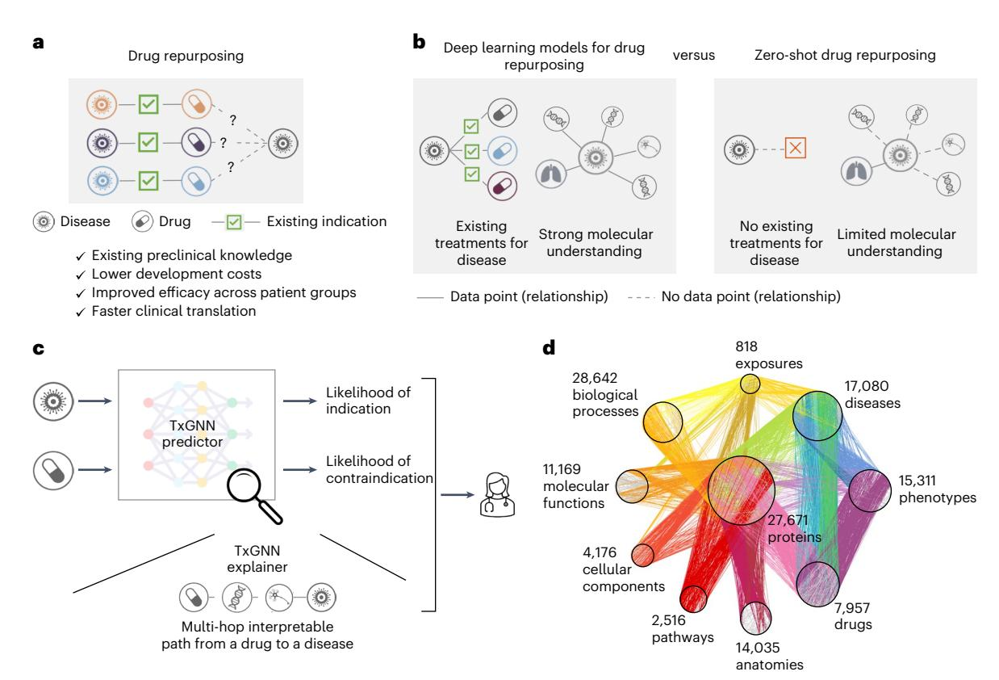
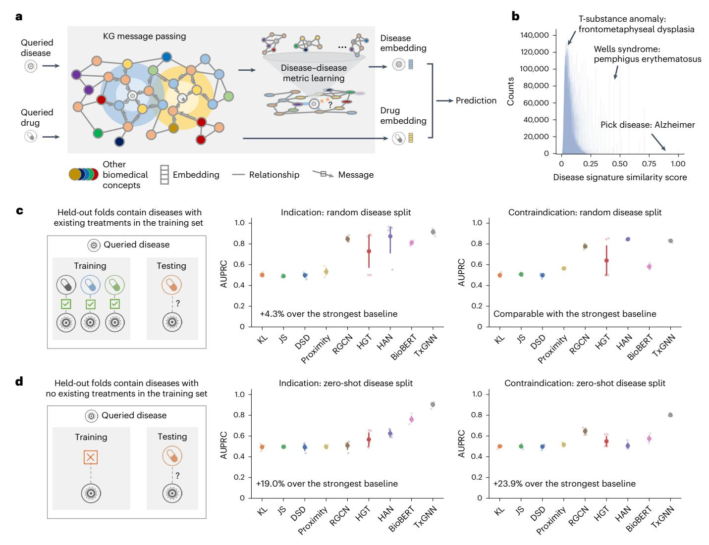
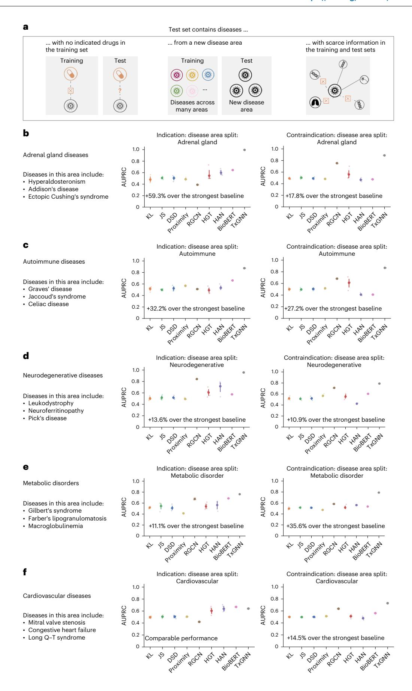
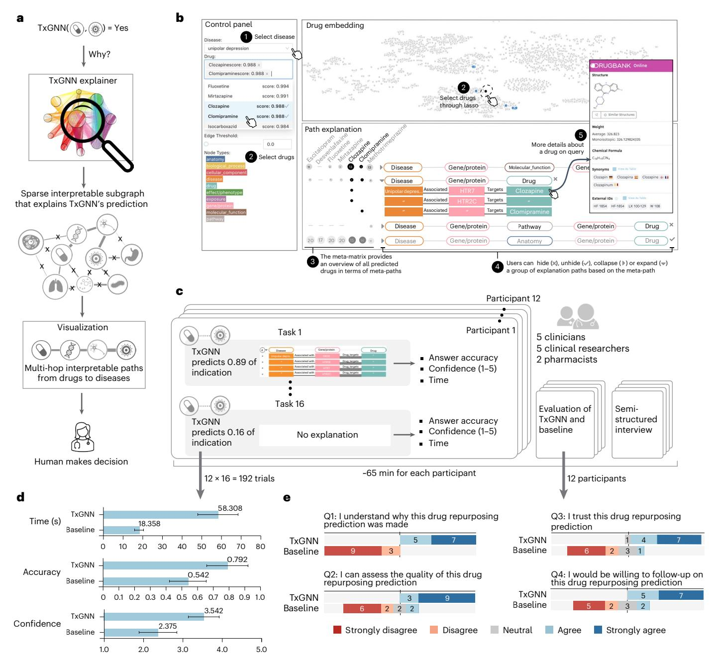
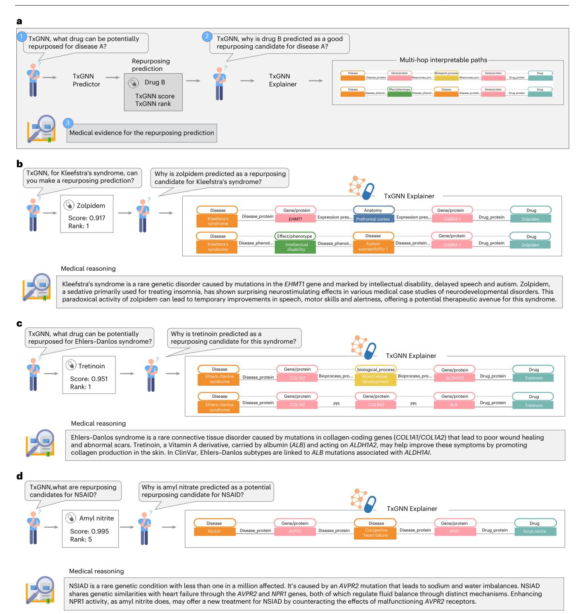
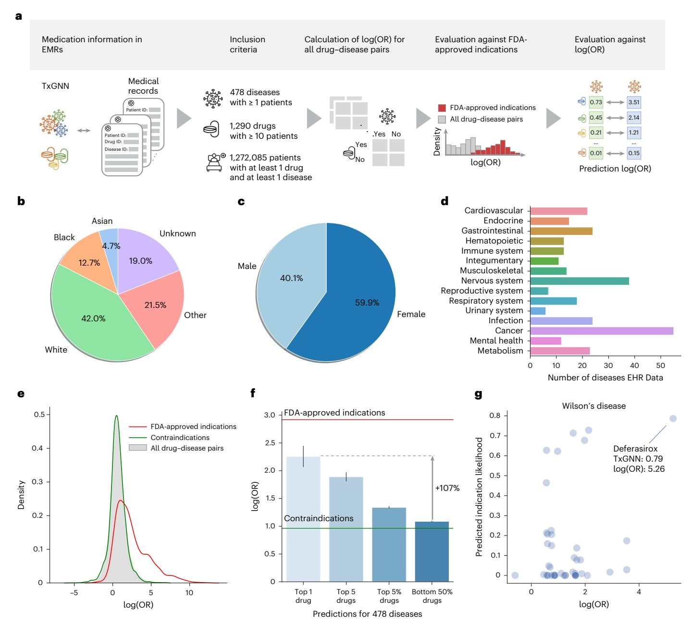

# nature medicine

**Article** 

https://doi.org/10.1038/s41591-024-03233-x

# A foundation model for clinician-centered drug repurposing

Received: 23 September 2023

Accepted: 5 August 2024

Published online: 25 September 2024

Kexin Huang © 1,9,10, Payal Chandak © 2,10, Qianwen Wang 1, Shreyas Havaldar 3, Akhil Vaid © 3,4, Jure Leskovec © 5, Girish N. Nadkarni © 4, Benjamin S. Glicksberg 3,4, Nils Gehlenborg 1 & Marinka Zitnik © 1,6,7,8

Drug repurposing—identifying new therapeutic uses for approved drugs—is often a serendipitous and opportunistic endeavour to expand the use of drugs for new diseases. The clinical utility of drug-repurposing artificial intelligence (AI) models remains limited because these models focus narrowly on diseases for which some drugs already exist. Here we introduce TxGNN, a graph foundation model for zero-shot drug repurposing. identifying therapeutic candidates even for diseases with limited treatment options or no existing drugs. Trained on a medical knowledge graph, TxGNN uses a graph neural network and metric learning module to rank drugs as potential indications and contraindications for 17,080 diseases. When benchmarked against 8 methods, TxGNN improves prediction accuracy for indications by 49.2% and contraindications by 35.1% under stringent zero-shot evaluation. To facilitate model interpretation, TxGNN's Explainer module offers transparent insights into multi-hop medical knowledge paths that form TxGNN's predictive rationales. Human evaluation of TxGNN's Explainer showed that TxGNN's predictions and explanations perform encouragingly on multiple axes of performance beyond accuracy. Many of TxGNN's new predictions align well with off-label prescriptions that clinicians previously made in a large healthcare system. TxGNN's drug-repurposing predictions are accurate, consistent with off-label drug use, and can be investigated by human experts through multi-hop interpretable rationales.

There is a pressing need to develop therapies for many diseases that currently lack treatments1,2. Of over 7,000 rare diseases worldwide, only 5–7% have Food and Drug Administration (FDA)-approved drugs3. Leveraging existing therapies and expanding their use by identifying new therapeutic indications via drug repurposing can alleviate the global disease burden. Drug repurposing leverages existing safety and efficacy data of approved drugs, allowing for faster translation to the clinic and reduced development costs compared to developing new

drugs from scratch4 (Fig. 1a). The premise behind repurposing is that drugs can have pleiotropic effects beyond the mechanism of action of their direct targets5. Approximately 30% of FDA-approved drugs are issued at least one new post-approval indication and many drugs have accrued over ten indications over the years6. However, most repurposed drugs are the result of serendipity7,8—either observed through off-label prescriptions written by clinicians, as with gabapentin and bupropion8, or discovered through patient experience, as with sildenafil6.

1Department of Biomedical Informatics, Harvard Medical School, Boston, MA, USA. 2Harvard-MIT Program in Health Sciences and Technology, Cambridge, MA, USA. 3Hasso Plattner Institute for Digital Health, Icahn School of Medicine at Mount Sinai, Mount Sinai, NY, USA. 4Charles Bronfman Institute for Personalized Medicine, Icahn School of Medicine at Mount Sinai, NY, USA. 5Department of Computer Science, Stanford University, Stanford, CA, USA. 6Broad Institute of MIT and Harvard, Cambridge, MA, USA. 7Harvard Data Science Initiative, Cambridge, MA, USA. 8Kempner Institute for the Study of Natural and Artificial Intelligence, Harvard University, Cambridge, MA, USA. 9Present address: Department of Computer Science, Stanford University, Stanford, CA, USA. 10These authors contributed equally: Kexin Huang, Payal Chandak. ⊠e-mail: marinka@hms.harvard.edu

**Fig. 1 | TxGNN is a graph foundation model for drug repurposing, identifying candidate drugs for diseases with limited treatment options and limited molecular data. a**, Drug repurposing involves the exploration of new therapeutic applications for existing drugs to treat diseases. Leveraging existing safety and efficacy data can dramatically cut costs and time to deliver life-saving therapeutics. **b**, Computational drug repurposing considered for diseases with already available treatments and well-understood molecular mechanisms. However, many diseases lack treatments and a complete understanding of disease mechanisms. These inherent constraints pose challenges for AI models.

TxGNN addresses this challenge by formulating drug repurposing as a zeroshot prediction problem. **c**, TxGNN presents an AI framework that generates actionable predictions for zero-shot drug repurposing. The TxGNN geometric deep-learning model incorporates a vast and comprehensive biological KG to accurately predict the likelihood of indication or contraindication for any given disease–drug pair. In addition, TxGNN generates explainable multi-hop paths, facilitating human understanding of how the prediction is grounded in medical knowledge. **d**, The TxGNN model trained on a medical KG of disease mechanisms across 17,080 diseases and drug mechanisms of action for 7,957 drugs.

Predicting the efficacy of all drugs against all diseases would enable us to select drugs with fewer side effects, design more effective treatments targeting multiple points in a disease pathway and systematically repurpose existing drugs for new therapeutic use.

Owing to technological advances, the effects of drugs can now be prospectively matched to new indications by systematically analyzing medical knowledge graphs (KGs)[5](#page-10-4)[,9](#page-10-8) . These strategies identify therapeutic candidates based on their impact on cell signaling, gene expression and disease phenotypes[5](#page-10-4)[,10](#page-11-2)[–12](#page-11-3). Machine learning has been used to analyze high-throughput molecular interactomes to unravel genetic architecture perturbed in diseas[e12](#page-11-3)[,13](#page-11-4) and help design therapies to target them[14](#page-11-5). To provide therapeutic predictions, geometric deep-learning models optimized on large medical KG[s15](#page-11-6) can match disease signatures to therapeutic candidates based on networks perturbed in diseas[e15–](#page-11-6)[18.](#page-11-7)

Although computational approaches have identified promising repurposing candidates for complex diseases[16](#page-11-0),[19](#page-11-8)[,20](#page-11-9), there remain two key challenges that could enhance the clinical relevance of repurposing predictions. First, these approaches assume that we want to make therapeutic predictions for diseases that already have existing drugs. Although this is the case for some diseases[9](#page-10-8) , a long tail of diseases does not satisfy this assumption—92% of 17,080 diseases examined in our study have no indications. Moreover, around 95% of rare diseases have no FDA-approved drugs and up to 85% of rare diseases do not have even one drug developed that would show promise in rare disease treatment, diagnosis or prevention[21.](#page-11-10) This long tail of diseases with few or no therapies and limited molecular understanding presents a challenge for drug-repurposing models. Second, a repurposed indication for a therapeutic candidate can be unrelated to the indication for which the drug was initially studied. Originally developed to help with morning sickness during pregnancy, thalidomide was repurposed in 1964 for an autoimmune complication of leprosy and again in 2006 for multiple myeloma[8](#page-10-7) . Collectively, we refer to these challenges as the zero-shot drug-repurposing problem (Fig. [1b\)](#page-1-0). To be clinically useful, machine learning models must make 'zero-shot' predictions, that is, they need to extend therapeutic predictions to diseases with incomplete understanding and, furthermore, to diseases without FDA-approved drugs. Unfortunately, the ability of existing machine learning models to identify therapeutic candidates for diseases with incomplete, sparse data and zero-known therapies drops drastically[16,](#page-11-0)[22](#page-11-1) (as we demonstrate across eight benchmarks in Fig. [2c,d](#page-2-0)).

In the present study, we introduced TxGNN, a graph foundation model for multi-disease, zero-shot drug repurposing that predicts drug-repurposing candidates across 17,080 diseases, including diseases without treatments (Fig. [1c\)](#page-1-0). Foundation models like TxGNN are transforming deep learning: instead of training disease-specific models for every disease, TxGNN is a single pretrained model that adapts across many diseases. TxGNN is trained on a medical KG that collates decades of biological research across 17,080 diseases (Fig. [1d](#page-1-0)). It uses a graph neural network (GNN) model to embed drugs and diseases into a latent representational space optimized to reflect the geometry

**Fig. 2**| TxGNN accurately predicts drug indications and contraindications. **a**, TxGNN: a deep-learning model that learns to reason over a large-scale KG to predict the relationship between drugs and disease. In zero-shot repurposing, limited indication and mechanism information are available for the queried disease. Our key insight revolves around the interconnectedness of biological systems. We recognize that diseases, despite their distinctiveness, can exhibit partial similarities and share multiple underlying mechanisms. Based on this motivation, we have developed a specialized module known as disease pooling, which harnesses the power of network medicine principles. This module identifies mechanistically similar diseases and employs them to enhance the information available for the queried disease. The disease pooling module has substantially improved the prioritization of repurposing candidates within zero-shot settings. **b**, The TxGNN disease similarity score provides a nuanced and meaningful measure of the relationship between diseases. This metric empowers TxGNN to discover similar diseases that can inform and enrich the mechanistic

understanding of queried diseases lacking treatment information.  ${\bf c}$ , The conventional Al-based repurposing evaluating indication predictions on diseases where the model may have seen other approved drugs during training. In this scenario, we show that TxGNN achieves good performance along with existing methods.  ${\bf d}$ , Provision of a more realistic evaluation, by introducing a new setup for assessing zero-shot repurposing, where the model is evaluated on diseases that have no approved drugs available during training. In this challenging setting, we observed a notable degradation in performance for baseline methods. In contrast, TxGNN consistently exhibits robust performance, surpassing the best baseline by up to 19% for indications and 23.9% for contraindications. These results highlight TxGNN's reasoning capabilities when confronted with queried diseases lacking treatment options. For both  ${\bf c}$  and  ${\bf d}$ , the evaluation uses the AUPRC and is conducted with five random data splits (n=5). The average performance is shown and the 95% confidence intervals (Cls) are represented by error bars.

of TxGNN's medical KG. To make zero-shot therapeutic predictions, TxGNN implements a metric learning module to transfer knowledge from treatable diseases to diseases with no treatments. Once trained, TxGNN performs zero-shot inference on new diseases without additional parameters or fine-tuning. To facilitate the interpretation of drug candidates, we developed a TxGNN Explainer module that offers transparent insights into the multi-hop interpretable paths that form TxGNN's predictive rationales. TxGNN's predictions and explanations are available at http://txgnn.org. Our human evaluation of TxGNN's Explainer showed that TxGNN's explanations perform encouragingly

on multiple axes of performance, including accuracy, trust, usefulness and time efficiency. Many of TxGNN's predictions have shown alignment with off-label prescriptions made by clinicians in a large healthcare system and TxGNN's predictive rationales are consistent with medical reasoning.

#### Results

#### Overview of TxGNN zero-shot drug-repurposing model

Zero-shot drug repurposing involves predicting therapeutic candidates for diseases with limited or no treatment options (Fig. 1b).

Mathematically, the model inputs a queried drug–disease pair and outputs the likelihood of the drug acting on the disease. The gold standard labels for evaluating such a model come from our previously curated medical KG[9](#page-10-8) (Fig. [1d](#page-1-0) and Supplementary Tables 4 and 5), which consists of 9,388 indications and 30,675 contraindications[23.](#page-11-11) The medical KG covers 17,080 diseases, 92% lacking FDA-approved drugs, covering rare and less-understood complex diseases. The KG also comprises 7,957 potential drug-repurposing candidates, ranging from FDA-approved drugs to experimental drugs investigated in ongoing clinical trials. Our model for zero-shot drug-repurposing TxGNN (Methods and Supplementary Fig. 2) operates on the principle that effective drugs directly target disease-perturbed networks or indirectly propagate therapeutic effects through disease-associated networks. TxGNN has two modules: the TxGNN Predictor module predicts drug indications and contraindications and the TxGNN Explainer module finds interpretable multi-hop knowledge paths that connect the queried drug to the queried disease (Fig. [1c\)](#page-1-0).

The TxGNN Predictor module consists of a GNN optimized on the relationships in the medical KG (Methods). Through large-scale, self-supervised pretraining, the GNN produces meaningful representations for all concepts in the KG. The pretrained model is adapted to process therapeutic tasks and predict candidate indications and contraindications of drugs across an array of diseases through fine-tuning, with no or minimal additional training of the model. TxGNN leverages an additional metric learning component for zero-shot prediction, capitalizing on the insight that diseases can share disease-associated genetic and genomic networks[10,](#page-11-2)[14](#page-11-5) and, thus, medical knowledge of disease-associated networks can be transferred by the model from well-annotated diseases to other diseases to enhance predictions on diseases with limited treatment options (Fig. [2a](#page-2-0) and Supplementary Fig. 1). This is achieved by creating a disease signature vector for each disease concept based on its neighbors and the topology of the local disease-associated network in the KG. The similarity between diseases is measured by the normalized dot product of their signature vectors. As most diseases do not share underlying pathology, they have low similarity scores. In contrast, relatively high disease similarity scores (>0.2) suggest similar disease mechanisms (Fig. [2b\)](#page-2-0).

When querying a specific disease, TxGNN retrieves similar diseases, generates embeddings for them and adaptively aggregates them based on their similarity to the queried disease. The aggregated output embedding summarizes knowledge borrowed from similar diseases fused with the queried disease embedding. This step can be interpreted as a graph rewiring technique in the geometric machine learning literature (Supplementary Fig. 3). TxGNN processes different therapeutic tasks, such as indication and contraindication prediction, in a unified manner using drug and disease representations from the unified latent space of the KG (Methods). Given a queried disease, TxGNN ranks drugs based on their predicted likelihood scores, offering a prioritized list of drug-repurposing candidates.

Although TxGNN Predictor provides likelihood scores for drug-repurposing candidates, more than these are needed for trustworthy model use. Human experts seek to understand the reasoning behind these predictions to validate the model's hypotheses and better understand candidate treatment mechanisms. To this end, TxGNN Explainer parses the KG to extract and succinctly represent relevant medical knowledge. TxGNN uses a self-explanatory approach called GraphMas[k24](#page-11-12) (Methods). GraphMask generates a sparse yet sufficient subgraph of medical concepts considered critical by TxGNN for prediction. TxGNN produces an importance score between 0 and 1 for every edge in the medical KG. It relates a drug to disease through multi-hop paths that form TxGNN's predictive rationale, with 1 indicating that the edge is vital for prediction and 0 suggesting that it is irrelevant. TxGNN Explainer combines the drug–disease subgraph and edge importance scores to produce multi-hop interpretable rationales relating disease to the predicted drug. TxGNN Explainer offers granular explanations that are, as we show in a human evaluation study, aligned with human expert intuition.

We developed a human-centered tool with TxGNN's predictions and multi-hop interpretable paths. Among a range of designs (Supplementary Figs. 4 and 5), we focused on path-based reasoning because our human evaluation study demonstrated that this design choice enhanced clinician comprehension and satisfactio[n25](#page-11-13).

#### **Treatment matching and zero-shot drug repurposing**

We evaluated model performance in drug repurposing across various holdout datasets (Supplementary Tables 1 and 2). We generated a holdout dataset by sampling diseases from the KG. These diseases were deliberately omitted during the training phase and later served as test cases to gauge the model's ability to generalize its insights to previously unseen diseases. These held-out diseases were chosen randomly, following a standard evaluation strategy, or specifically selected to evaluate zero-shot prediction. In our study, we used both holdout datasets to evaluate methods. We compared TxGNN with eight methods in predicting therapeutic use. They included network medicine statistical techniques, including Kullback–Leibler (KL) and Jensen–Shannon ( JS) divergenc[e16,](#page-11-0) graph-theoretical network proximity approac[h19,](#page-11-8) diffusion state distance (DSD[\)17,](#page-11-14) state-of-the-art GNN methods, including relational graph convolutional networks (RGCNs[\)18](#page-11-7)[,26,](#page-11-15) heterogeneous graph transformer (HGT)[27](#page-11-16) and heterogeneous attention networks (HANs)[28](#page-11-17) and a natural language-processing model, BioBERT[29](#page-11-18) (Supplementary Note 4).

We first implemented a standard benchmarking strategy used to evaluate drug-repurposing AI models, where drug–disease treatment pairs were randomly shuffled and a subset of these pairs was set aside as a holdout set (testing set; Fig. [2c\)](#page-2-0). Under this strategy, the diseases evaluated as holdouts had some drug indications and contraindications in the training dataset. Therefore, the generalization objective was to identify therapeutic candidates for diseases with some existing drugs. This evaluation method aligns with the approach predominantly used in the literature[12](#page-11-3)[,14](#page-11-5)[–16](#page-11-0)[,18–](#page-11-7)[20](#page-11-9). We use the area under the precision-recall curve (AUPRC) as the evaluation metric because it measures a model's recall and precision tradeoff at different thresholds. Our experimental results in this setting concur, with three of eight existing methods achieving AUPRC > 0.80 and HAN as the best at 0.873 AUPRC. TxGNN also performed similarly to these established approaches. In predicting indications, TxGNN achieved a 4.3% increase in AUPRC (0.913) over HAN.

These results show that machine learning models can identify additional candidate drugs for diseases that already have some existing FDA-approved drugs. However, Duran et al[.30](#page-11-19) reasoned that these models make predictions for a disease by retrieving drugs from the dataset that appear similar to existing treatments. This suggests that the standard evaluation strategy is inappropriate for evaluating diseases without FDA-approved drugs (Fig. [1b\)](#page-1-0). Given this limitation, we considered models under zero-shot drug repurposing. We began by holding out a random set of diseases and then moved all their associated drugs to the holdout set (Fig. [2d](#page-2-0)). From a biological standpoint, the model was required to predict therapeutic candidates for diseases that lacked treatments, meaning that it had to operate without any available data on drug similarities. In this scenario, TxGNN outperformed all existing methods by a large margin. TxGNN substantially improves over the next best method in predicting indications (19.0% AUPRC gain) and contraindications (23.9% AUPRC gain). Although established methods achieved satisfactory results in conventional drug-repurposing evaluations, they often fell short in challenging settings. TxGNN was the only method that achieved consistent performance across all settings.

### **Zero-shot drug-repurposing evaluation across disease areas**

Diseases with shared mechanisms can also share effective drugs[10](#page-11-2). For instance, selective serotonin reuptake inhibitors (SSRIs) can address multiple psychiatric conditions, including major depressive disorder, anxiety disorder and obsessive–compulsive disorder. If, during training, a model learns that an SSRI is indicated for major depressive disorder, it does not take a large leap to suggest that the same SSRI could be effective for obsessive–compulsive disorder during testing[22](#page-11-1). This phenomenon is known as shortcut learning[31](#page-11-20) and underlies many deep-learning failures[32.](#page-11-21) Shortcut decision rules tend to perform well on standard benchmarks but fail on challenging conditions[33](#page-11-22), such as predicting drugs for rare diseases with no treatment options or subtypes of complex diseases with distinct disease mechanisms.

To evaluate drug-repurposing models for these challenging diseases, we curated a stringent holdout dataset that contained a group of biologically related diseases, termed 'disease area'. For each disease area, all drug indications and contraindications were removed from the training dataset, along with a fraction of relationships between drug and other medical concepts in the KG. This dataset split evaluates model performance for diseases with limited molecular data and no existing drugs (Fig. [3a](#page-4-0)). Under this setup, diseases in the holdout evaluation set have considerably fewer neighbors than in the training set (Supplementary Fig. 6). In the present study, we considered nine diverse disease area holdout datasets characterized in Supplementary Table 3 and listed here in order of increasing disease area size: (1) diabetes-related diseases such as gestational diabetes and lipoatrophic diabetes; (2) 'adrenal gland' diseases, including Addison's syndrome and ectopic Cushing's syndrome; (3) 'autoimmune' diseases, including celiac disease and Graves' disease; (4) 'anemia' with conditions such as thalassemia and hemoglobin C disease; (5) 'neurodegenerative' diseases including Pick's disease and neuroferritinopathy; (6) 'mental health' disorders, including anorexia nervosa and depressive disorder; (7) 'metabolic' disorders, including macroglobulinemia and Gilbert's syndrome; (8) 'cardiovascular' diseases, including long Q–T syndrome and mitral valve stenosis; and (9) 'cancerous' diseases, including neurofibroma and Leydig's cell tumors.

We benchmarked TxGNN on rigorous holdout datasets (Fig. [3b–f](#page-4-0) and Supplementary Fig. 7) and found consistent improvement over existing methods. TxGNN achieved relative AUPRC gains of 0.5–59.3% (average 25.72%) across 9 disease areas for indications and 11.8–35.6% (average 18.67%) for contraindications. BioBERT performed best for indication prediction in seven of nine disease areas, whereas RGCN was the best baseline for contraindications in eight of nine. However, TxGNN outperformed all methods across all nine disease areas for both tasks, demonstrating its broad generalizability and accuracy in zero-shot drug repurposing.

Visualization of TxGNN Predictor's latent representations shows that it can transfer knowledge from unrelated diseases to those with limited data (Supplementary Fig. 8). Evaluation metrics, including AUROC and recall, are detailed in Supplementary Figs. 9–11. Ablation analyses confirmed that each component of the TxGNN Predictor is essential for its performance (Supplementary Fig. 12). Stress tests with additional data splits, minimal disease connections to the KG (Supplementary Fig. 13), masked local neighborhoods (Supplementary Fig. 14) and various KG configurations (Supplementary Fig. 15) demonstrated that TxGNN maintains a strong predictive performance.

**Fig. 3 | TxGNN predicts drug indications and contraindications across challenging disease areas with small molecular datasets. a**, Nine 'disease area' splits constructed to evaluate how well each model can generalize to new diseases when using only a limited amount of disease-associated molecular data and no information about its treatments. The diseases in the holdout set: (1) have no approved drugs in training, (2) have limited overlap with the training disease set because we excluded similar diseases and (3) lack molecular data because we deliberately removed their biological neighbors from the training set. These data splits constitute challenging but realistic evaluation scenarios that mimic zero-

#### **TxGNN's explanations reflect model's predictive rationales**

TxGNN extracts multi-hop interpretable paths as sequences of associations between medical concepts in the KG that establish a connection between a predicted drug and a predicted disease to substantiate TxGNN's prediction. This tool isolates maximally predictive subgraphs that connect the queried drug to the queried disease through multiple hops, following relationships in the KG. The performance of these subgraphs is almost equivalent to that of the entire KG. Focusing on the most predictive relationships (that is, edges with importance scores >0.5, representing an average of 14.9% of edges from the KG), the model's performance showed a slight reduction from AUPRC = 0.890 (s.d. 0.006) to AUPRC = 0.886 (s.d. 0.005), indicating that TxGNN's Explainer effectively identifies key associations[34](#page-11-23) and explanations accurately reflect TxGNN's internal reasoning. Conversely, when excluding edges deemed predictive by TxGNN and considering the remaining irrelevant relationships (that is, edges with importance scores <0.5, accounting for an average of 85.1% of edges), the predictive performance dropped from AUPRC = 0.890 (s.d. 0.006) to AUPRC = 0.628 (s.d. 0.026).

To assess the quality of TxGNN's explanations, we used three established metrics[34:](#page-11-23) insertion, which measures predictive performance using only the top *K*% of edges ranked highest by explanation weight; deletion, which assesses performance after removing the top *K*% of edges considered most explainable; and stability, which evaluates the consistency of explanation weights through Pearson's correlation before and after introducing random perturbations to the KG. In addition, we experimented with three graph explainability methods: GNNExplainer[35](#page-11-24), Integrated Gradients[36](#page-11-25) and Information Bottlenec[k37](#page-11-26). As shown in Supplementary Fig. 16, the top-ranked explainable edges are crucial, impacting performance when either removed from or inserted into a graph. The performance remained consistent across all insertion and deletion percentages. In addition, TxGNN Explainer demonstrated the most stable explanation weights under various levels of KG perturbation. These analyses confirm that TxGNN's multi-hop interpretable paths capture elements of the KG that are most critical for making accurate predictions.

#### **Human-centric evaluation of TxGNN's drug candidates**

To examine the utility of TxGNN's multi-hop interpretable paths for human expert evaluations, we conducted a pilot human study with clinicians and scientists (see Supplementary Fig. 17 for the study interface). The study participants included five clinicians, five clinical researchers and two pharmacists (seven male and five female experts, mean age = 34.3 years; Fig. [4c](#page-6-0)). For assessing drug–disease indication predictions, these participants were asked to evaluate 16 predictions from TxGNN, 12 of which were accurate. We recorded participants' assessment accuracy, exploration time and confidence scores for each prediction, totaling 192 trials (16 predictions × 12 participants; Supplementary Tables 4 and 5). The user study took around 65 min on average, including assessing drug–disease indication predictions from TxGNN, a usability questionnaire and a semi-structured interview.

In evaluating the drug-repurposing candidates, participants reported a significant improvement in accuracy (+46%, *P* = 0.0443) and confidence (+49%, *P* = 0.0041) when predictions were provided with explanations. Participants took more time to think (*P* = 0.0014),

shot drug-repurposing settings. **b**–**f**, Holdout folds evaluating diseases related to adrenal glands (**b**), autoimmune diseases (**c**), neurodegenerative diseases (**d**), metabolic disorders (**e**) and cardiovascular diseases (**f**). The results for four disease areas—anemia, diabetes, cancer and mental health—are provided in Supplementary Fig. 7. Raw scores are provided in Supplementary Tables 1 and 2. TxGNN shows up to 59.3% improvement over the next best baseline in ranking therapeutic candidates, measured by AUPRC. Each method under each split is conducted with five random data splits (*n* = 5). The average performance is shown and the 95% CIs are represented by error bars.

Fig. 4 | Development, visualization and evaluation of multi-hop interpretable paths in TxGNN Explainer. a, Predictions alone are often insufficient for trustworthy machine learning model deployment. We developed TxGNN  $Explainer to aid human \, experts \, using \, graph \, AI \, explainability \, techniques. \, TxGNN \,$ Explainer identifies a sparse, interpretable subgraph underlying the model's predictions. For each drug candidate, it generates a multi-hop path of biomedical concepts linking the disease to the drug. A visualization module then transforms these subgraphs into multi-hop paths that align with human cognitive processes. **b**, An interactive tool designed to help experts explore TxGNN predictions and explanations. The 'Control panel' lets users select a disease and view top-ranked predictions. The 'Edge threshold' module adjusts the sparsity of explanations, controlling the density of displayed multi-hop paths. The 'Drug embedding' panel compares a selected drug's position with the entire repurposing candidate library. The 'Path explanation' panel shows crucial biological relationships for TxGNN's therapeutic predictions. c. Evaluating the usefulness of TxGNN explanations by conducting a user study involving five clinicians, five clinical

researchers and two pharmacists. These participants were shown  $16\ drug-$  disease pairs with TxGNN's predictions, where  $12\ predictions$  were accurate. For each pairing, participants indicated whether they agreed or disagreed with TxGNN's predictions using the explanations provided.  $\mathbf{d}$ , Comparison of the performance of TxGNN Explainer with a no-explanation baseline regarding user answer accuracy, task completion time and user confidence. The results are aggregated on  $192\ trials$  ( $12\ participants \times 16\ tasks$ ) and reveal a significant improvement in accuracy (P=0.044), confidence (P=0.004) and time to think (P=0.0013) when explanations were provided. Error bars represent 95% CIs and the center of the error bar is the average performance. The statistics are computed using a two-sided Tukey's HSD test without multiple-test adjustments.  $\mathbf{e}$ , The qualitative usability questions for participants after the user study. Human experts agreed that the explanations provided by TxGNN helped assess drugrepurposing candidates and instilled greater trust in the TxGNN's predictions than using predictions alone.

to contextualize TxGNN's explanations with their domain expertise, which led to more confident decision-making (confidence +49%, *P* = 0.0041).

In the post-task questionnaires and interviews, participants reported greater satisfaction when using TxGNN Explainer compared with the baseline (Fig. [4e](#page-6-0)), with 11 of 12 (91.6%) agreeing or strongly agreeing that the predictions and explanations provided by TxGNN were valuable. In contrast, without explanations, 8 of 12 (75.0%) disagreed or strongly disagreed with relying on TxGNN's predictions. Participants expressed significantly more confidence in correct predictions made by TxGNN when the TxGNN Explainer was included (*t*(11) = 3.64*, P* < 0.01, using a two-sided Tukey's honestly significant difference (HSD) test[38](#page-11-27)). Some participants indicated that multi-hop interpretable explanations were helpful when examining molecular target interactions identified by TxGNN Explainer and guiding evaluations of potential adverse drug events.

#### **Aligning TxGNN's predictive rationales with medical evidence**

We examined whether predicted drugs and their multi-hop explanations align with medical reasoning for three rare diseases. The evaluation protocol was structured into three stages (Fig. [5a](#page-8-0)). Initially, a human expert queried TxGNN Predictor to identify drugs potentially repurposable for a specific disease. The TxGNN Predictor provided a candidate drug, specifying the confidence in the prediction and its comparative ranking against other candidates. Subsequently, the TxGNN Explainer was queried to elucidate why the selected drug was considered for repurposing. This model revealed its rationale through multi-hop interpretable paths linking the disease to the drug via intermediate biological interactions. In the final stage, independent medical evidence was collected and analyzed to verify the model's predictions and explanations.

First, we examined TxGNN's predictions for Kleefstra's syndrome, a rare disease caused by mutations in the *EHMT1* gene. This condition leads to speech delays, autism spectrum disorder and childhood hypotonia, often featuring underdeveloped brains with dormant neuronal pathways. On querying the TxGNN Predictor, zolpidem was recommended as the number one drug-repurposing candidate (Fig. [5b](#page-8-0)). Initially, zolpidem seemed problematic for underdeveloped brains as a result of its sedative effect on γ-aminobutyric acid (GABA)-A receptors (*GABRG2* gene). However, TxGNN Explainer indicated that zolpidem's action on *GABRG2* might reduce autism susceptibility and improve prefrontal cortex function. Surprisingly, zolpidem has shown stimulative effects in neurological conditions, temporarily awakening underactive neurons, suggesting a potential therapeutic use for neurodevelopmental disorders[39](#page-11-28). This paradoxical improvement can enhance speech, motor skills and alertness in individuals with severe brain injuries or neurodevelopmental disorders, as supported by anecdotal evidence and some clinical studies[40](#page-11-29)[,41](#page-11-30). TxGNN's prediction and explanatory rationale align with medical evidence about zolpidem's mechanism of action despite these clinical cases not being seen by the model during training.

Next, we examined TxGNN's prediction of tretinoin for Ehlers– Danlos syndrome, a rare connective tissue disorder affecting 1–9 individuals per 100,000. This disorder results from mutations in collagen-coding genes (*COL1A1* and *COL1A2*) and is characterized by impaired wound healing and atypical scars. TxGNN Predictor ranks tretinoin, a vitamin A derivative used for acne, as the top drug-repurposing candidate. Tretinoin, transported by albumin (*ALB*) and targeting *ALDH1A2*, helps mitigate collagen loss and inflammation, as highlighted in TxGNN's predictive rationale (Fig. [5c](#page-8-0)), indicating that TxGNN's predictive rationale is aligned with medical reasoning. Tretinoin may help in Ehlers–Danlos syndrome by potentially enhancing wound healing and improving the appearance of scars as a result of its ability to stimulate collagen production in the skin. Furthermore, some subtypes of Ehlers–Danlos syndrome have been associated with a pathogenic mutation in the *ALB* gene in ref. [42](#page-11-31) and weakly linked to *ALDH1AI* in ref. [43.](#page-11-32) TxGNN Explainer's reasoning about the pathways that connect tretinoin to Ehlers–Danlos syndrome was consistent with this evidence.

In the final example, we looked at a rare condition, nephrogenic syndrome of inappropriate antidiuresis (NSIAD). This disease is characterized by water and sodium imbalance caused by a mutation in the *AVPR2* gene. Patients with congestive heart failure face similar fluid retention challenges and the condition has been strongly associated with both *AVPR2* and *NPR1* genes[44–](#page-11-33)[46](#page-11-34). TxGNN Predictor identified amyl nitrite among the top five drugs (Fig. [5d](#page-8-0)). TxGNN Explainer suggested that the relationship between NSIAD and amyl nitrite passes through *AVPR2*, congestive heart failure and *NPR1*. *AVPR2* and *NPR1* genes play pivotal roles in regulating fluid and electrolyte balance via complementary but distinct pathways. *AVPR2* contributes to water retention and urine concentration, whereas *NPR1* facilitates vasodilatation, lowers blood pressure and enhances water excretion[47.](#page-11-35) Enhancing *NPR1* activity could counteract the excessive water reabsorption caused by the malfunctioning *AVPR2* receptors in patients with NSIAD. Amyl nitrite, which targets the *NPR1* gene, emerges as a potential therapeutic option for NSIAD, confirming the consistency of TxGNN's explanations with medical evidence.

#### **Evaluation of TxGNN using EMRs**

TxGNN's strong performance suggests that its novel predictions—that is, drugs not yet clinically approved for a disease but ranked highly by TxGNN—may hold a potential clinical value. As these therapies have not yet been approved for treatment, there is no established gold standard against which to validate them. Recognizing the longstanding clinical practice of off-label drug prescription, we used the enrichment of disease–drug pair co-occurrence in a health system's electronic medical records (EMRs) as a proxy measure for being a potential indication. From the Mount Sinai Health System medical records, we curated a cohort of 1,272,085 adults with at least one drug prescription and one diagnosis each (Fig. [6a](#page-9-0)). This cohort was 40.1% male and the average age was 48.6 years (s.d. 18.6 years). The demographic breakdown is in Fig. [6b,c](#page-9-0). Diseases were included if at least one patient was diagnosed with it and drugs were included if prescribed to a minimum of ten patients (Supplementary Table 6 and Methods), resulting in a dataset of 478 diseases and 1,290 drugs (Fig. [6d\)](#page-9-0).

Across these medical records, we measured disease–drug co-occurrence enrichment as the ratio of the odds of using a specific drug for a disease to the odds of using it for other diseases. We derived 619,200 log(odd ratio) (log(OR)) values for every drug–disease pair and applied necessary statistical corrections (Methods). We found that FDA-approved drug–disease pairs exhibited substantially higher log(OR) values than other pairs (Fig. [6e\)](#page-9-0). Contraindications represented a potential confounding factor in this analysis because adverse drug events could increase the co-occurrence between drug–disease pairs. However, in our study of contraindications, we found no enrichment in the co-occurrence of drug–disease pairs, which suggested that adverse drug effects were not a major confounding factor.

For each of the 478 EMR-phenotyped diseases, TxGNN produced a ranked list of therapeutic candidates. We omitted drugs already linked to the disease, categorized the remaining new candidates into top one, top five, top 5% and bottom 50%, and calculated their respective mean log(OR) values (Fig. [6f\)](#page-9-0). The top-ranked (top one) predicted drugs had, on average, a 107% higher log(OR) than the mean log(OR) of the bottom 50% predictions. This suggested that TxGNN's top candidate had much higher enrichment in the medical records and, thereby, had a greater likelihood of being a relevant indication. In addition, the log(OR) increased as we broadened the fraction of retrieved candidates, suggesting that TxGNN's prediction scores were meaningful in capturing the likelihood of indication. Although the average log(OR) stands at 1.09, the top therapeutic candidate predicted by TxGNN had a log(OR)

Fig. 5 | Drug-repurposing predictions and multi-hop interpretable paths produced by TxGNN align with medical evidence. a, We assessed the alignment of drug-repurposing candidates identified by TxGNN with established medical reasoning across three rare diseases. The process begins with the TxGNN Predictor, which selects potential drugs for repurposing based on a queried disease, and continues with the TxGNN Explorer, which provides interpretable paths explaining the selection. Our case studies conclude with independent verification of the TxGNN's predictions against clinical knowledge, showcasing the congruence between the TxGNN's recommendations and medical insights. b, TxGNN predicts zolpidem, typically used as a sedative, as a repurposing candidate for Kleefstra's syndrome, characterized by developmental delays and neurological symptoms. Despite zolpidem's conventional inhibitory effects on the brain, TxGNN Explainer suggests its potential to enhance prefrontal cortex

activity and improve cognitive functions in those with Kleefstra's syndrome. TxGNN's counterintuitive recommendation aligns with emerging clinical evidence of zolpidem's ability to awaken dormant neurons, potentially aiding speech, motor skills and alertness in patients with neurodevelopmental disorders. **c**, TxGNN identifies tretinoin as the top candidate for treating Ehlers–Danlos syndrome. TxGNN's predictive rationale is rooted in the drug's interactions with albumin (*ALB*) and *ALDH1A2*, which aligns with medical insights about Ehlers–Danlos syndrome with regard to collagen loss and inflammation mitigation. **d**, TxGNN identifying amyl nitrite as a therapeutic option for NSIAD. In NSIAD, an *AVPR2* mutation leads to water and sodium imbalances. TxGNN Explorer points out the connection between NSIAD and amyl nitrite through congestive heart failure, a condition with similar fluid retention issues, by exploring gene interactions (*AVPR2* and *NPR1*) that regulate electrolyte balance.

**Fig. 6 | Evaluating TxGNN's predictions in a large healthcare system. a**, The steps for evaluating TxGNN's novel indication predictions using EMRs. First, we matched the drugs and diseases in the TxGNN KG to the EMR database, resulting in a curated cohort of 1.27 million patients spanning 478 diseases and 1,290 drugs. Next, we calculated the log(OR) for each drug—disease pair to indicate drug usage for specific diseases. We validated the log(OR) metric as a proxy for clinical usage by comparing drug—disease pairs against FDA-approved indications. Finally, we evaluated TxGNN's novel predictions to determine if their log(OR) values exhibited enrichment within the medical records. **b**, The racial diversity within the patient cohort. **c**, The sex distribution of the patient cohort. **d**, The medical records encompass a diverse range of diseases spanning major disease areas. **e**, A substantial enrichment of log(OR) values for FDA-approved drugs in validating log(OR) values as a proxy metric for clinical prescription, although most drug—disease pairs exhibited low log(OR) values. In addition, we noted that contraindications displayed similar log(OR) values to the general

nonindicated drug—disease pairs, minimizing potential confounders such as adverse drug effects.  $\mathbf{f}$ , Evaluation of  $\log(OR)$  values for the novel indications proposed by TxGNN. The y axis represents the  $\log(OR)$  values of the disease—drug pairs, serving as a proxy for clinical usage. We ranked TxGNN's predictions for each disease and extracted the average  $\log(OR)$  values for the top predicted drug (n=470), top five predicted drugs (n=2,314), top 5% predicted drugs (n=27,618) and bottom 50% predicted drugs (n=123,718). The red line represents the average  $\log(OR)$  for FDA-approved indications, whereas the green line represents the average  $\log(OR)$  for contraindications. Predicted drugs are consistent with off-label prescription decisions made by clinicians. The error bar is a 95% Cl.  $\mathbf{g}$ , Provision of a case study of TxGNN's predicted scores plotted against the  $\log(OR)$  for Wilson's disease. Each point on the plot represents a therapeutic candidate. The top most likely drug identified by TxGNN is highlighted, indicating its associated TxGNN and  $\log(OR)$  scores.

of 2.26, approaching the average log(OR) of 2.92 for FDA-approved indications, indicating the enrichment of off-label drug prescriptions among TxGNN's top-ranked predictions.

Examining TxGNN's predicted drugs for Wilson's disease, a rare disease causing excessive copper accumulation that frequently instigates liver cirrhosis in children (Fig. 6g), we observed that TxGNN

predicts the likelihood close to zero for most drugs, with only a select few drugs highly likely to be indications. TxGNN ranked deferasirox as the most promising candidate for Wilson's disease. Wilson's disease and deferasirox had a log(OR) of 5.26 in the medical records and the literature indicates that it may effectively eliminate hepatic iron[48.](#page-11-36) In a separate analysis, we evaluated TxGNN on ten recent FDA approvals introduced after the knowledge cutoff date (Supplementary Table 7). TxGNN consistently ranked newly introduced drugs favorably and, in two instances, placed the newly approved medications within the top 5% of predicted drugs.

#### **Discussion**

Drug repurposing has been embraced as a drug discovery approach to address the productivity issues of the cost, time to market and inherent risks of developing entirely new drugs. Although the conventional 'one disease–one predictive model' approach has been used for drug repurposing to enhance success rates, most successful cases have resulted from unexpected findings in clinical and preclinical in vivo settings. We propose that a comprehensive approach to drug repurposing can be realized using a multi-disease predictive strategy. Existing predictive models often assume that effective drugs exist for a queried disease or closely related diseases. This assumption overlooks a vast array of diseases—92% of the 17,080 that we analyzed—lacking pre-existing indications and known molecular target interactions. Addressing the needs of these diseases, many of which are complex, neglected or rare, is a clinical priorit[y2](#page-10-1)[,49.](#page-11-37) We define this challenge as zero-shot drug repurposing.

We developed TxGNN, a graph foundation model that addresses this challenge head on, specifically targeting diseases with limited data and treatment opportunities. TxGNN achieves state-of-the-art performance in drug repurposing by leveraging a network medicine principle focusing on disease–treatment mechanism[s15.](#page-11-6) When asked to suggest therapeutic candidates for a disease, TxGNN identifies diseases with shared pathways, phenotypes and pathologies, extracts relevant knowledge and fuses it into the disease of interest. TxGNN generalizes to diseases with few treatment options by modeling latent relationships between diseases and performing zero-shot inference for diseases that the model never encountered during training. The design behind TxGNN enables effective zero-shot drug repurposing and can be adapted for other use cases, such as drug target discovery and targeted therapy selection.

TxGNN is a unified model for predicting indications and contraindications across 17,080 diseases, suitable for early drug repurposing beyond single therapeutic areas. Our findings suggest that multi-disease predictive models yield more repositioned drug candidates than single-area approaches. Predicted drugs align with off-label prescription rates in EMRs and match with the medical consensus of human experts. Although these estimates suggest beneficial therapeutic potential for existing drugs, predicted drugs would need extensive screening to establish safety and efficacy and determine other drug parameters, such as drug dosage and the sequence and timing of treatments.

TxGNN generates multi-hop interpretable explanations, offering rationales for predicted drugs. These rationales can be analyzed to assess whether predicted drugs might elicit additional biological responses, considering the original indication or molecular target interactions identified by TxGNN. A pilot human evaluation showed that experts could more effectively examine predicted drugs and identify failure points with multi-hop explanations than alternative explanation visualizations. These findings confirm the importance of considering clinical needs and explainability when integrating machine learning models into discovery workflows[50.](#page-11-38)

Although TxGNN demonstrates promising performance for zero-shot drug repurposing, its capabilities depend on the quality of medical KGs. These graphs may need more comprehensive information on host–pathogen interactions, necessary for repurposing drugs for infectious diseases and information on the pathogenicity of genetic variants, which are crucial for identifying repurposing opportunities for genetic diseases[51](#page-11-39). Challenges such as data biases and potentially outdated information in medical KGs must be addressed. Strategies for overcoming these issues include using techniques for continual learning and model editing[52](#page-11-40) and data management approaches for automatically updating KG[s9](#page-10-8) when new data become available. Another fruitful future direction is using uncertainty quantification techniques to evaluate the reliability of model predictions[53.](#page-12-0) We also envision integrating patient information with medical KGs to provide personalized drug-repurposing predictions. Our pilot human evaluation engaged a small number (*n* = 12) of clinicians and scientists and prioritized an in-depth analysis with a small but qualified group of human experts over a broader study with a larger, potentially less specialized, participant pool. Although the results were encouraging and this participant number is representative of related studies that evaluate highly specialized tools[54](#page-12-1),[55,](#page-12-2) a human evaluation study with a larger sample size could incorporate a greater diversity of user expertise and consider various drug-repurposing use cases. Despite the promising performance of TxGNN's predictions on medical records, unaccounted confounders and selection biases might have limited the ability to draw conclusions from the calculated drug enrichment scores.

TxGNN's zero-shot drug-repurposing capability allows the model to predict drugs for diseases with limited treatment options and scarce information. Multi-hop interpretable predictive rationales can enhance transparent use of TxGNN, fostering trust and aiding human experts. TxGNN streamlines drug-repurposing prediction, especially when the limited availability of disease-specific datasets hinders drug development. Multi-disease models like TxGNN highlight the potential for AI models to help with the development of new therapeutics.

#### **Online content**

Any methods, additional references, Nature Portfolio reporting summaries, source data, extended data, supplementary information, acknowledgements, peer review information; details of author contributions and competing interests; and statements of data and code availability are available at [https://doi.org/10.1038/s41591-024-03233-x.](https://doi.org/10.1038/s41591-024-03233-x)

#### **References**

- 1. Feigin, V. L. et al. Burden of neurological disorders across the us from 1990-2017: a global burden of disease study. *JAMA Neurol.* **78**, 165–176 (2021).
- 2. O'Connell, D. Neglected diseases. *Nature* **449**, 157–157 (2007).
- 3. Rare Disease Day 2021. *US Food and Drug Administration* [fda.gov/](https://www.fda.gov/news-events/fda-voices/rare-disease-day-2021-fda-shows-sustained-support-rare-disease-product-development-during-public) [news-events/fda-voices/rare-disease-day-2021-fda-shows-sustai](https://www.fda.gov/news-events/fda-voices/rare-disease-day-2021-fda-shows-sustained-support-rare-disease-product-development-during-public) [ned-support-rare-disease-product-development-during-public](https://www.fda.gov/news-events/fda-voices/rare-disease-day-2021-fda-shows-sustained-support-rare-disease-product-development-during-public) (2023).
- 4. Pushpakom, S. et al. Drug repurposing: progress, challenges and recommendations. *Nat. Rev. Drug Discov.* **18**, 41–58 (2019).
- 5. Abdelsayed, M., Kort, E. J., Jovinge, S. & Mercola, M. Repurposing drugs to treat cardiovascular disease in the era of precision medicine. *Nat. Rev. Cardiol.* **19**, 751–764 (2022).
- 6. Sahragardjoonegani, B., Beall, R. F., Kesselheim, A. S. & Hollis, A. Repurposing existing drugs for new uses: a cohort study of the frequency of FDA-granted new indication exclusivities since 1997. *J. Pharm. Policy Pract.* **14**, 3 (2021).
- 7. Sardana, D. et al. Drug repositioning for orphan diseases. *Brief. Bioinform.* **12**, 346–356 (2011).
- 8. Jourdan, J.-P., Bureau, R., Rochais, C. & Dallemagne, P. Drug repositioning: a brief overview. *J. Pharm. Pharmacol.* **72**, 1145–1151 (2020).
- 9. Chandak, P., Huang, K. & Zitnik, M. Building a knowledge graph to enable precision medicine. *Sci. Data* **10**, 67 (2023).

- 10. Menche, J. et al. Uncovering disease-disease relationships through the incomplete interactome. *Science* **347**, 1257601 (2015).
- 11. Zitnik, M. et al. Evolution of resilience in protein interactomes across the tree of life. *Proc. Natl Acad. Sci. USA* **116**, 4426–4433 (2019).
- 12. Ruiz, C., Zitnik, M. & Leskovec, J. Identification of disease treatment mechanisms through the multiscale interactome. *Nat. Commun.* **12**, 1–15 (2021).
- 13. Goh, K.-I. et al. The human disease network. *Proc. Natl Acad. Sci. USA* **104**, 8685–8690 (2007).
- 14. Baraba´si, A.-L., Gulbahce, N. & Loscalzo, J. Network medicine: a network-based approach to human disease. *Nat. Rev. Genet.* **12**, 56–68 (2011).
- 15. Li, M. M., Huang, K. & Zitnik, M. Graph representation learning in biomedicine and healthcare. *Nat. Biomed. Eng.* **6**, 1353–1369 (2022).
- 16. Gysi, D. M. et al. Network medicine framework for identifying drug-repurposing opportunities for Covid-19. *Proc. Natl Acad. Sci. USA* **118**, e2025581118 (2021).
- 17. Cao, M. et al. Going the distance for protein function prediction: a new distance metric for protein interaction networks. *PLoS ONE* **8**, e76339 (2013).
- 18. Zitnik, M., Agrawal, M. & Leskovec, J. Modeling polypharmacy side efects with graph convolutional networks. *Bioinformatics* **34**, i457–i466 (2018).
- 19. Guney, E., Menche, J., Vidal, M. & Bara´basi, A.-L. Network-based in silico drug eficacy screening. *Nat. Commun.* **7**, 1–13 (2016).
- 20. Cheng, F., Kova´cs, I. A. & Baraba´si, A.-L. Network-based prediction of drug combinations. *Nat. Commun.* **10**, 1–11 (2019).
- 21. Fermaglich, L. J. & Miller, K. L. A comprehensive study of the rare diseases and conditions targeted by orphan drug designations and approvals over the forty years of the orphan drug act. *Orphanet J. Rare Dis.* **18**, 1–8 (2023).
- 22. Guney, E. Reproducible drug repurposing: when similarity does not sufice. In *Pacific Symposium on Biocomputing* 132–143 (World Scientific, 2017).
- 23. Avram, S. et al. DrugCentral 2021 supports drug discovery and repositioning. *Nucleic Acids Res.* **49**, D1160–D1169 (2021).
- 24. Schlichtkrull, M. S., De Cao, N. & Titov, I. Interpreting graph neural networks for NLP with diferentiable edge masking. In *International Conference on Learning Representations* (2021).
- 25. Wang, Q., Huang, K., Chandak, P., Zitnik, M. & Gehlenborg, N. Extending the nested model for user-centric XAI: a design study on gnn-based drug repurposing. *IEEE Trans. Vis. Comput. Graph.* **29**, 1266–1276 (2023).
- 26. Schlichtkrull, M. et al. Modeling relational data with graph convolutional networks. In *The Semantic Web: 15th International Conference, ESWC 2018* (eds Gangemi, A. et al.) 593–607 (Springer, 2018).
- 27. Hu, Z., Dong, Y., Wang, K., & Sun, Y. Heterogeneous graph transformer. In *Proc. of the World Wide Web Conference 2020* (eds Huang, Y. et al.) 2704–2710 (Association for Computing Machinery, 2020).
- 28. Wang, X., Ji, H., Shi, C., Wang, B., Ye, Y., Cui, P. & Yu, P .S. Heterogeneous graph attention network. In *Proc. of the World Wide Web Conference 2019* (eds Liu, L. & White, R. et al.) 2022–2032 (Association for Computing Machinery, 2019).
- 29. Lee, J. et al. BioBERT: a pre-trained biomedical language representation model for biomedical text mining. *Bioinformatics* **36**, 1234–1240 (2020).
- 30. Duran-Frigola, M. et al. Extending the small-molecule similarity principle to all levels of biology with the chemical checker. *Nat. Biotechnol.* **38**, 1087–1096 (2020).

- 31. Bickel, S., Brückner, M. & Schefer, T. Discriminative learning under covariate shift. *J. Mach. Learn. Res.* **10**, 2137–2155 (2009).
- 32. Niven, T. & Kao, H.-Y. Probing neural network comprehension of natural language arguments. In *Proc. of the 57th Annual Meeting of the Association for Computational Linguistics* 4658–4664 (ACL, 2019).
- 33. Geirhos, R. et al. Shortcut learning in deep neural networks. *Nat. Mach. Intell.* **2**, 665–673 (2020).
- 34. Agarwal, C., Queen, O., Lakkaraju, H. & Zitnik, M. Evaluating explainability for graph neural networks. *Sci. Data* **10**, 144 (2023).
- 35. Ying, Z., Bourgeois, D., You, J., Zitnik, M. & Leskovec, J. GNNExplainer: generating explanations for graph neural networks. *NeurIPS* **32**, 9244–9255 (2019).
- 36. Sundararajan, M., Taly, A. & Yan, Q. Axiomatic attribution for deep networks. In *Proc. of the International Conference on Machine Learning* 3319–3328 (PMLR, 2017).
- 37. Wang, J. et al. Empower post-hoc graph explanations with information bottleneck: a pre-training and fine-tuning perspective. In *Proc. of the 29th ACM SIGKDD Conference on Knowledge Discovery and Data Mining* 2349–2360 (2023).
- 38. Tukey, J. W. Comparing individual means in the analysis of variance. *Biometrics* **5**, 99–114 (1949).
- 39. Bomalaski, M. N., Claflin, E. S., Townsend, W. & Peterson, M. D. Zolpidem for the treatment of neurologic disorders: a systematic review. *JAMA Neurol.* **74**, 1130–1139 (2017).
- 40. Boisgontier, J. et al. Case report: zolpidem's paradoxical restorative action: a case report of functional brain imaging. *Front. Neurosci.* **17**, 1127542 (2023).
- 41. Sripad, P. et al. Efect of zolpidem in the aftermath of traumatic brain injury: an MEG study. *Case Rep. Neurol. Med.* **2020**, 8597062 (2020).
- 42. Landrum, M. J. et al. Clinvar: improvements to accessing data. *Nucleic Acids Res.* **48**, D835–D844 (2020).
- 43. Javed, S. et al. ALDH1 & CD133 in invasive cervical carcinoma & their association with the outcome of chemoradiation therapy. *Indian J. Med. Res.* **154**, 367 (2021).
- 44. Ghoussaini, M. et al. Open targets genetics: systematic identification of trait-associated genes using large-scale genetics and functional genomics. *Nucleic Acids Res.* **49**, D1311–D1320 (2021).
- 45. Goltsman, I. et al. Rosiglitazone treatment restores renal responsiveness to atrial natriuretic peptide in rats with congestive heart failure. *J. Cell. Mol. Med.* **23**, 4779–4794 (2019).
- 46. Bryan, P. M., Xu, X., Dickey, D. M., Chen, Y. & Potter, L. R. Renal hyporesponsiveness to atrial natriuretic peptide in congestive heart failure results from reduced atrial natriuretic peptide receptor concentrations. *Am. J. Physiol. Ren. Physiol.* **292**, F1636–F1644 (2007).
- 47. Wishart, D. S. et al. DrugBank 5.0: a major update to the DrugBank database for 2018. *Nucleic Acids Res.* **46**, D1074–D1082 (2018).
- 48. Seetharaman, J. & Sarma, M. S. Chelation therapy in liver diseases of childhood: current status and response. *World J. Hepatol.* **13**, 1552 (2021).
- 49. Alsentzer, E. et al. Few shot learning for phenotype-driven diagnosis of patients with rare genetic diseases. Preprint at *medRxiv* <https://doi.org/10.1101/2022.12.07.22283238> (2024).
- 50. Zhang, A., Xing, L., Zou, J. & Wu, J. C. Shifting machine learning for healthcare from development to deployment and from models to data. *Nat. Biomed. Eng.* **6**, 1330–1345 (2022).
- 51. Dufy, A. et al. Development of a human genetics-guided priority score for 19,365 genes and 399 drug indications. *Nat. Genet.* **56**, 51–59 (2024).
- 52. Cheng, J., Dasoulas, G., He, H., Agarwal, C. & Zitnik, M. GNNDelete: a general strategy for unlearning in graph neural networks. In *Proc. of the International Conference on Learning Representations* (2023).

- 53. Huang, K., Jin, Y., Candes, E. & Leskovec, J. Uncertainty quantification over graph with conformalized graph neural networks. *Adv. Neural Inf. Process. Syst.* **36**, 26699–26721 (2024).
- 54. Cai, C. J. et al. Human-centered tools for coping with imperfect algorithms during medical decision-making. In *Proc. of the 2019 CHI Conference on Human Factors in Computing Systems* 1–14 (2019).
- 55. Macefield, R. How to specify the participant group size for usability studies: a practitioner's guide. *J. Usability Stud.* **5**, 34–45 (2009).

**Publisher's note** Springer Nature remains neutral with regard to jurisdictional claims in published maps and institutional afiliations.

**Open Access** This article is licensed under a Creative Commons Attribution-NonCommercial-NoDerivatives 4.0 International License, which permits any non-commercial use, sharing, distribution and reproduction in any medium or format, as long as you give appropriate credit to the original author(s) and the source, provide a link to the Creative Commons licence, and indicate if you modified the licensed material. You do not have permission under this licence to share adapted material derived from this article or parts of it. The images or other third party material in this article are included in the article's Creative Commons licence, unless indicated otherwise in a credit line to the material. If material is not included in the article's Creative Commons licence and your intended use is not permitted by statutory regulation or exceeds the permitted use, you will need to obtain permission directly from the copyright holder. To view a copy of this licence, visit [http://creativecommons.org/licenses/by-nc-nd/4.0/.](http://creativecommons.org/licenses/by-nc-nd/4.0/)

© The Author(s) 2024

#### **Methods**

Most data used for this present study were obtained from publicly available knowledge repositories. For internal data, the Institutional Review Board at Mount Sinai, New York City, USA, approved the retrospective analysis of internal EMRs. All internal EMRs were deidentified before computational analysis and model development. Patients were not directly involved or recruited for the study. Informed consent was waived for analyzing EMRs retrospectively.

#### Curation of a medical KG dataset

The KG is heterogeneous, with 10 types of nodes and 29 types of undirected edges. It contains 123,527 nodes and 8,063,026 edges. Supplementary Tables 8 and 9 show a breakdown of nodes by node type and edges by edge type, respectively. The KG and all auxiliary data files are available via Harvard Dataverse at https://doi.org/10.7910/DVN/IXA7BM. Supplementary Note 1 provides detailed information about datasets and curation of the KG.

#### **Problem definition**

We are given a heterogeneous KG,  $G = (\mathcal{V}, \mathcal{E}, \mathcal{T}_R)$ , with nodes in the node set  $i \in \mathcal{V}$ , edges  $e_{i,j} = (i,r,j)$  in the edge set  $\mathcal{E}$ , where  $r \in \mathcal{T}_R$  indicates the relationship type, and i is called the head/source node and j the tail/target node. Each node also belongs to a node type set  $\mathcal{T}_V$ . Each node also has an initial embedding, which we denote as  $\mathbf{h}_i^{(0)}$ . Given a disease i and drug j, we want to predict the likelihood of the drug being indicated or contraindicated for the disease. Our approach induces inductive priors by incorporating factual knowledge from the KG into the model, enhancing its reasoning capabilities for hypothesis formation and drug candidate prediction. Detailed experimental protocols, including data split curation, negative sampling, hyperparameter tuning and additional details, are described in Supplementary Note 4.

#### Overview of TxGNN approach

TxGNN is a deep-learning approach for mechanistic predictions in drug discovery based on molecular networks perturbed in disease and targeted by therapeutics. TxGNN is composed of four modules: (1) a heterogeneous GNN-based encoder to obtain biologically meaningful network representation for each biomedical entity; (2) a disease similarity-based metric learning decoder to leverage auxiliary information to enrich the representation of diseases that lack molecular characterization; (3) an all-relationhip stochastic pretraining followed by a drug—disease centric, full-graph, fine-tuning strategy; and (4) a graph explanatory module to retain a sparse set of edges that are crucial for prediction as a post-training step. Next, we expanded each module in detail.

#### Heterogeneous GNN encoder

Our objective was to learn a general encoder of a biomedical KG by learning a numerical vector (embedding) for each node, encapsulating the biomedical knowledge contained within its neighboring relational structures. This involves transforming initial node embeddings using a sequence of local graph-based, nonlinear function transformations to refine embeddings 56. These transformations are subject to iterative optimization, guided by a loss function that minimizes incorrect drug predictions. The system converges to an optimized set of node embeddings through this process.

**Step 1:** initializing latent representations. We denote the input node embedding  $\mathbf{X}_i$  for each node i, which is initialized using Xavier uniform initialization. For every layer l of message passing, there are the following three stages: steps 2–4.

Step 2: propagating relationship-specific neural messages. For every relationship type, we first calculated a transformation of node embedding from the previous layer  $\mathbf{h}_i^{(l-1)}$ , where the first layer  $\mathbf{h}_i^{(0)} = \mathbf{x}_i$ .

This was achieved by applying a relationship-specific weight matrix  $W_{rM}^{(l)}$  on the previous layer embedding:

$$\mathbf{m}_{r,i}^{(l)} = \mathcal{W}_{r,M}^{(l)} \mathbf{h}_{i}^{(l-1)}.$$

**Step 3:** aggregating local network neighborhoods. For each node i, we aggregated on the incoming messages from neighboring nodes of each relation, r, denoted as  $\mathcal{N}_i^r$ , by taking the average of these messages:

$$\widetilde{\mathbf{m}^{(l)}_{r,i}} = \frac{1}{|\mathcal{N}_r(i)|} \sum_{i \in \mathcal{N}^r} \mathbf{m}_{r,j}^{(l)}.$$

**Step 4: updating latent representations.** We then combined the node embedding from the last layer and the aggregated messages from all relationships to obtain the new node embedding:

$$\mathbf{h}_{i}^{(l)} = \mathbf{h}_{i}^{(l-1)} + \sum_{r \in \mathcal{T}_{R}} \widetilde{\mathbf{m}^{(l)}_{r,i}}$$

After L layers of propagation, we arrived at our encoded node embeddings  $\mathbf{h}_i$  for each node i.

#### Predicting drug candidates

TxGNN employs disease and drug embeddings to predict indications and contraindications for each disease—drug pair. Considering the three relationship types needing prediction, each type was assigned a trainable weight vector  $\mathbf{w}_r$ . The interaction likelihood for a specific relationship is then determined using the DistMult approach57. Formally, for a disease i, drug j and relation r, the predicted likelihood p is calculated as follows:

$$p_{i,j,r} = \frac{1}{1 + \exp\left(-\operatorname{sum}\left(\mathbf{h}_{i} \times \mathbf{w}_{r} \times \mathbf{h}_{j}\right)\right)}.$$

#### **Embedding-based disease similarity search**

Research on diseases varies widely based on their prevalence and complexity. For instance, the molecular basis of many rare diseases remains poorly understood21. Despite this, rare diseases often offer extensive opportunities for therapeutic advancements3. This shortage of research is evident in the biological KG, where rare diseases are characterized by a lack of relevant nodes and edges, leading to lower-quality graph embeddings. Empirical evidence indicates that GNN models exhibit substantially reduced predictive performance on splits designed to reflect the sparse nature of knowledge on these diseases, as opposed to random splits (Fig. 2c,d).

Network embeddings for these diseases lack significance owing to sparse prior information in the KG. Thus, a model is needed to enhance these embeddings. Human physiology is an interconnected system where diseases exhibit similarities. Using a model to extract predictive information from similar but better-represented diseases in the KG, the target disease embedding can be enriched, improving model performance for the disease. To this end, TxGNN employed a three-step procedure: (1) construct a disease signature vector to capture complex disease similarities; (2) use an aggregation mechanism to combine similar disease embeddings into a comprehensive auxiliary embedding; and (3) introduce a gating mechanism to modulate the influence between the original and auxiliary disease embeddings, acknowledging that well-characterized diseases may not need supplementation. Each step is elaborated on in the following sections.

**Step 1: disease signature vectors.** The primary objective of this module was to derive a signature vector  $\mathbf{p}_i$  for each disease i. Given the

insufficiency of disease representations produced solely by GNNs, these representations are not ideal for direct similarity computations. Instead, we employed graph-theoretical methods  $^{14}$  to calculate disease similarities. In addition, variations of signature vectors are detailed in Supplementary Note 2. Specifically, we generated a vector that encapsulates the local neighborhoods surrounding a disease. For disease i, the signature vector is formally defined as follows:

$$\boldsymbol{p}_i = [p_1 \cdots p_{|\mathcal{V}_p|} e p_1 \cdots e p_{|\mathcal{V}_{pp}|} e x_1 \cdots e x_{|\mathcal{V}_{EX}|} d_1 \cdots d_{|\mathcal{V}_D|}]$$

where

$$\begin{split} \mathbf{p}_j &= \begin{cases} 1 & \textit{if} \ j \in \mathcal{N}_i^{\mathcal{D}} \\ 0 & \textit{otherwise} \end{cases}, \mathbf{ep}_j = \begin{cases} 1 & \textit{if} \ j \in \mathcal{N}_i^{\mathcal{ED}} \\ 0 & \textit{otherwise} \end{cases}, \mathbf{ex}_j = \begin{cases} 1 & \textit{if} \ j \in \mathcal{N}_i^{\mathcal{EX}} \\ 0 & \textit{otherwise} \end{cases}, \mathbf{d}_j \\ &= \begin{cases} 1 & \textit{if} \ j \in \mathcal{N}_i^{\mathcal{D}} \\ 0 & \textit{otherwise} \end{cases}, \end{split}$$

and  $\mathcal{N}_{i}^{\mathcal{D}}$ ,  $\mathcal{N}_{i}^{\mathcal{ED}}$ ,  $\mathcal{N}_{i}^{\mathcal{EX}}$ ,  $\mathcal{N}_{i}^{\mathcal{D}}$  is the set of gene/protein, effect/phenotype, exposure, disease nodes lying in the one-hop neighborhood of disease i. We also adopted the dot product as the similarity measure, which means that the similarity is the sum of all shared nodes across the four node types:

$$\mathsf{sim}(i,j) = \mathbf{p}_i \mathbf{p}_j = |\mathcal{N}_i^{\mathcal{P}} \cap \mathcal{N}_i^{\mathcal{P}}| + |\mathcal{N}_i^{\mathcal{E}\mathcal{P}} \cap \mathcal{N}_i^{\mathcal{E}\mathcal{P}}| + |\mathcal{N}_i^{\mathcal{E}\mathcal{X}} \cap \mathcal{N}_i^{\mathcal{E}\mathcal{X}}| + |\mathcal{N}_i^{\mathcal{D}} \cap \mathcal{N}_i^{\mathcal{D}}|$$

Given the signature for diseases and calculated similarities among the diseases, for a queried disease, we can then obtain the k most similar diseases for a queried disease i:

$$\mathcal{D}_{\mathsf{sim},i} = \mathsf{argmax}_{j \in \mathcal{V}_{\mathcal{D}}} \mathsf{sim}(i,j).$$

**Step 2:** disease metric learning. Given a set of similar diseases, TxGNN generates disease embeddings that integrate various measures of disease similarity into a unified embedding, capable of augmenting the representation of a queried disease that may be sparsely annotated. To achieve this, we adopted a weighted scheme, wherein each disease was weighted according to its similarity score, as follows:

$$\mathbf{h}_{i}^{\text{sim}} = \sum_{i \in \mathcal{D}_{\text{sim}}} \frac{\sin(i,j)}{\sum_{k \in \mathcal{D}_{\text{sim}}} \sin(i,k)} \times \mathbf{h}_{j}.$$

**Step 3: gating disease embeddings.** The final stage involves updating the original disease embedding  $\mathbf{h}_i$  with the disease–disease metric earning embedding  $\mathbf{h}_i$  sim via a gating mechanism. This mechanism employs a scalar  $c \in [0,1]$  to modulate the influence between these two embeddings. Special consideration is needed because, for well-represented diseases in the KG, the disease–disease metric learning embedding might be unnecessary and could bias the disease embedding. Conversely, this embedding can be informative for accurate prediction of diseases with no existing drugs. Use of a learnable attention mechanism is ineffective, because it overvalues the original embeddings for well-represented diseases, neglecting the auxiliary embedding.

Alternatively, we introduced an approach that determines weighting based on the degree of node connectivity  $|\mathcal{N}_i^r|$  of the queried drugdisease pair. A higher degree indicated that the disease was better represented in the knowledge and had a denser local network neighborhood, suggesting a reduced reliance on the disease—disease metric learning embedding and vice versa. The scalar's value is designed to be high for minimal node degrees (0 or 1) and to decrease rapidly with increasing node degrees. To achieve this, we used an inflated exponential distribution density function with  $\lambda=0.7$ :

$$c_i = 0.7 \times \exp(-0.7 \times |\mathcal{N}_i^r|) + 0.2.$$

We observed that the result is not sensitive to  $\lambda$  (Supplementary Fig. 12). Finally, we used parameter search and found optimal  $\lambda = 0.7$ . Then, we could finally obtain an augmented disease embedding:

$$\widehat{\mathbf{h}}_i = c_i \times \mathbf{h}_i^{\text{sim}} + (1 - c_i) \times \mathbf{h}_i.$$

Finally, TxGNN used augmented disease embeddings as input to the latent decoder to produce drug predictions.

#### Training TxGNN deep graph models

The objective of the training process was to predict the presence of a relationship between two entities within a KG. The dataset for positive samples, denoted as  $\mathfrak{D}_+$ , comprises all pairs (i,j) across various relationship types r, with the label  $y_{i,r,j} = 1$  indicating the presence of a relationship. To generate the dataset for negative samples,  $\mathfrak{D}_-$ , we used a sampling technique detailed in Supplementary Notes 4 and 3, creating counterparts for each positive pair. For a given pair i,j and relationship type r, the model estimated the probability  $p_{i,r,j}$  of a relationship's existence. The training loss is then calculated using the binary crossentropy loss formula:

$$\mathcal{L} = \sum_{(i, r, j) \in \mathcal{D}_+ \cup \mathcal{D}_-} y_{i, r, j} \times \log(p_{i, r, j}) + (1 - y_{i, r, j}) \times \log(1 - p_{i, r, j}).$$

Previous research has emphasized KG completion, optimizing models across the entire spectrum of relationships within a KG  $^{\rm 58}$ . This approach, however, may dilute the model's capacity to capture specific knowledge, particularly when the interest lies solely in drug—disease relationships. Given that drug—disease interactions are governed by complex biological mechanisms, the extensive range of biomedical relationships in a KG can offer a comprehensive view of biological systems. The primary challenge lies in optimizing performance on a select group of relationships while beneficially leveraging the broader set of relationships for knowledge transfer, avoiding catastrophic forgetting of general knowledge.

To address this challenge, TxGNN used a pretraining strategy. Initially, TxGNN predicted relationships across the entire KG using stochastic mini-batching, encapsulating biomedical knowledge in enriched node embeddings. In the fine-tuning phase, TxGNN focused on drug–disease relationships, sharpening its ability to generate specific embeddings and optimizing drug-repurposing predictions.

#### **Pretraining TxGNN model**

TxGNN undergoes pretraining on millions of biomedical entity pairs across all relationships. As a result of the extensive number of edges, stochastic mini-batching is used to train on subsets of pairs at each step, ensuring coverage of all data pairs within each epoch. During this phase, degree-adjusted disease augmentation is deactivated and all relationship types are treated equally. The pretrained encoder weights are then used to initialize the encoder model for fine-tuning. It is important to note that the weights in the decoder, specifically for DistMult,  $\mathbf{w}_r$ , are reinitialized before fine-tuning to mitigate the risk of negative knowledge transfer.

#### **Fine-tuning TxGNN model**

After pretraining, the model initialization encapsulated a broad spectrum of biological knowledge. The next phase refined drugdisease relationship predictions by focusing solely on drugdisease pairs. Other relationship types remained in the KG to facilitate indirect information flow. During fine-tuning, the model activated the degree-adjusted interdisease embedding feature. TxGNN underwent both pretraining and fine-tuning end to end. The variant with the highest validation performance was selected for test set evaluation and downstream analyses.

#### Generating multi-hop interpretable explanations

In a trained drug-repurposing prediction model, consider a target node j and a neighboring source node i connected by an edge  $e_{i,j}$  at layer l. For each relationship r, intermediate messages  $\mathbf{m}_{r,i}^{(l)}$  and  $\mathbf{m}_{r,j}^{(l)}$  are computed. These embeddings are concatenated and input into a relationship-specific, single-layer neural network parameterized by  $W_{g,r}^{(l)}$ . This network predicts the probability of masking the message from source node i during the computation of the embedding of the target node j. The output is processed through a gate, which includes a sigmoid layer to constrain the probability to the range [0,1], followed by an indicator function that determines whether the edge should be dropped:

$$z_{i,j,r}^{(l)} = \mathbb{I}_{\mathbb{R}>0.5}\left(\text{sigmoid}\left(W_{g,r}^{(l)}\left(\mathbf{m}_{r,i}^{(l)}||\mathbf{m}_{r,j}^{(l)}\right)\right)\right)$$

such that  $z_{ij,r}^{(l)} \in 0,1$ . In practice, a location bias of 3 is added to the sigmoid function during initialization to ensure that its outputs are initially close to 1. This means that, at the start, the gates remain open, allowing the model to adaptively close the gates and mask edges within the subgraph as needed. This approach is essential because starting with random initialization, which drops edges randomly, creates a discrepancy between the original and updated predictions. Consequently, the model's primary focus shifts toward minimizing this discrepancy rather than balancing the two objectives. To refine this mechanism, when a gate outputs 0, the corresponding message is not simply removed. Instead, it is substituted with a learnable baseline vector  $\mathbf{b}_r^{(l)}$  for each relationship r and layer l. Therefore, the revised message from source node i to target node j is represented as follows:

$$\widehat{\mathbf{m}}_{i,r}^{(l)} = z_{i,j,r}^{(l)} \times \mathbf{m}_{i,r}^{(l)} + \left(1 - z_{i,j,r}^{(l)}\right) \times \mathbf{b}_{r}^{(l)}.$$

Two objectives guide the optimization of the GraphMask gate weights. The first, faithfulness, aims to ensure that the updated predictions, after applying the mask, align closely with the initial prediction outcomes. The second objective encourages the model to apply as extensive a masking as feasible. These objectives inherently entail a tradeoff: increasing the extent of masking tends to enlarge the discrepancy between the updated and original predictions. This scenario was addressed through constrained optimization, employing Lagrange relaxation to balance the objectives. Specifically, the optimization sought to maximize the Lagrange multiplier  $\lambda$  to enforce the constraint, while minimizing the primary objective. The loss function employed for this purpose is formulated as follows:

$$\max_{\lambda} \min_{W_g} \sum_{k=1}^{L} \sum_{(i,r,\, j) \in \mathcal{D}_{\lambda} \cup \mathcal{D}_{\omega}} \mathbb{1}_{[\mathbb{R} \neq 0]} z_{i,j,\, r}^{(k)} + \lambda(||\hat{p}_{i,j,\, r} - p_{i,j,\, r}||_2^2 - \beta),$$

where  $\beta$  is the margin between the updated and original predictions. After the training process is complete, edges (i,j,r) for which  $z_{i,j,r}^{(k)}=0$  can be removed. The remaining edges serve as explanations for the model's predictions. In addition, the value computed before applying the indicator function can be employed to quantify each edge's contribution to the prediction. This facilitates the adjustment of granular differences in the contributions. More detailed adaptations of the GraphMask approach are discussed in Supplementary Note 3.

#### Pilot usability evaluation of TxGNN with medical experts

The TxGNN Explorer was developed following a user-centric design study process, as outlined in our pilot study25. This process involved comparing three visual presentations of GNN explanations from the user's perspective. The findings from this comparison motivated the adoption of path-based explanations, which were preferred based on user feedback. The usability of the TxGNN Explorer was assessed

through a comparison with a baseline that displayed only drug predictions and their associated confidence scores.

For this usability study, 12 medical experts (7 male and 5 female experts, average age 34.25 years, referred to as P1–12) were recruited through personal contacts, Slack channels and email lists from collaborating institutions, with all participants providing informed consent. The group comprised five clinical researchers (P1–3, P11–12) and five practicing physicians (P4, P7–10), all holding MD degrees, and two medical school students with prior experience as pharmacists (P5, P6). Each participant had at least 5 years of experience in various medical specialties.

The study was conducted remotely via Zoom in compliance with COVID-19-related restrictions. Participants accessed the study system (as shown in Supplementary Fig. 17) using their own computers and sharing their screens with the interviewer. The sequence in which predictions were presented, along with the conditions (TxGNN Explorer or the baseline approach), were randomized and counterbalanced across participants and tasks.

In the drug assessment tasks, participants' accuracy, confidence levels and task completion times were evaluated across 192 trials (16 tasks  $\times$  12 participants). Specifically, participants were tasked with: (1) determining the correctness of a drug prediction (that is, whether the drug could potentially be used to treat the disease) and (2) rating their confidence in their decision on a 5-point Likert scale (1 = not confident at all, 5 = completely confident). The system automatically logged the time taken to evaluate each prediction.

On completion of all predictions, participants provided subjective ratings for both tasks regarding Trust, Helpfulness, Understandability and Willingness to Use, using a 5-point Likert scale (1 = strongly disagree, 5 = strongly agree). Subsequent semi-structured interviews yielded insights and feedback on the tool's predictions, explanations and overall user experience. Each session of the user study lasted approximately 65 min.

#### Analysis of medical records from a large healthcare system

Patient data from the Mount Sinai Health System's EMRs in New York City were utilized to examine patterns from predictions in clinical practice. The Mount Sinai Institutional Review Board approved the study, ensuring that all clinical data were deidentified. The initial cohort included over 10 million patients, refined to those aged >18 years with at least one drug and one diagnosis on record, resulting in 1,272,085 patients. This refined cohort comprised 40.1% males, with an average age of 48.6 years (s.d. 18.6 years). The racial composition of the dataset is detailed in Supplementary Table 6.

Disease and medication data were structured according to the Observational Medical Outcomes Partnership (OMOP) standard data model59. Predictions were generated for 1,363 diseases, identified by training a KG on 5% of randomly selected drug-disease pairs, serving as a validation set for early stopping. Disease names in the prediction dataset were aligned with SNOMED or International Classification of Diseases, 10th revision (ICD-10)60 codes and then mapped to OMOP concepts within the Mount Sinai data system. The analysis was restricted to diseases diagnosed in at least 1 patient, narrowing the focus to 478 conditions. Similarly, medication names were matched to DrugBank IDs, then to RxNorm IDs and OMOP concepts, limiting the scope to medications prescribed to at least 10 patients, resulting in 1,290 medications. Drug-disease pairs were further refined to those with at least 1 recorded instance of a patient being prescribed the drug for the disease, leading to 1,272,085 patients. Contingency tables were created for each drug-disease pair and Fisher's exact function was used to calculate two-sided ORs and P values for each pair. Two-sided Bonferroni's correction was applied to the P values using the statsmodels Python library's multi-test function, identifying statistically significant drug-disease pairs as those with P < 0.005.

#### **Inclusion and ethics statement**

We have complied with all relevant ethical regulations. Our research team represents a diverse group of collaborators. Roles and responsibilities were clearly defined and agreed on among collaborators before the start of the research. All researchers were included in the study design, study implementation, data ownership, intellectual property and authorship of publications. Our research did not face severe restrictions or prohibitions in the setting of the local researchers and no specific exceptions were granted for the present study in agreement with local stakeholders. Animal welfare regulations, environmental protection, risk-related regulations and transfer of biological materials, cultural artefacts or associated traditional knowledge out of the country do not apply to our research. Our research did not result in stigmatization, incrimination, discrimination or personal risk to participants. Appropriate provisions were taken to ensure the safety and well-being of all participants involved. Our team was committed to promoting equitable access to resources and benefits resulting from the research.

#### **Reporting summary**

Further information on research design is available in the Nature Portfolio Reporting Summary linked to this article.

#### **Data availability**

The KG dataset is available at Harvard Dataverse under a persistent identifier [https://doi.org/10.7910/DVN/IXA7BM.](https://doi.org/10.7910/DVN/IXA7BM) All clinical and medical record datasets were deidentified and dataset summary statistics were analyzed in the study. The anonymized patient data used retrospectively for this project, with institutional permission, are not publicly available as a result of restrictions. All requests from institution-affiliated researchers for access to processed data for purposes of study validation will be considered by the Charles Bronfman Institute for Personalized Medicine steering committee and should be directed to G.N.N. (girish.nadkarni@mountsinai.org), and will be handled within 1 month. Further information on related materials is available on TxGNN's website ([https://zitniklab.hms.harvard.edu/](https://zitniklab.hms.harvard.edu/projects/TxGNN) [projects/TxGNN](https://zitniklab.hms.harvard.edu/projects/TxGNN)).

#### **Code availability**

Python implementation of the methodology developed and used in the present study is available via the project website at [https://zit](https://zitniklab.hms.harvard.edu/projects/TxGNN)[niklab.hms.harvard.edu/projects/TxGNN](https://zitniklab.hms.harvard.edu/projects/TxGNN). The code to reproduce results, documentation and usage examples is at [https://github.](https://github.com/mims-harvard/TxGNN) [com/mims-harvard/TxGNN.](https://github.com/mims-harvard/TxGNN) We developed a web-based app available at [http://txgnn.org](http://txgnn.org/) to access TxGNN's predictions and predictive rationales.

#### **References**

- 56. Gilmer, J., Schoenholz, S. S., Riley, P. F., Vinyals, O. & Dahl, G. E. Neural message passing for quantum chemistry. In *Proc. of the International Conference on Machine Learning***70**, 1263–1272 (PMLR, 2017).
- 57. Yang, B., Yih, S. W. T., He, X., Gao, J. & Deng, L. Embedding entities and relations for learning and inference in knowledge bases. In *Proc. of the International Conference on Learning Representations* (2015).
- 58. Lin, Y., Liu, Z., Sun, M., Liu, Y. & Zhu, X. Learning entity and relation embeddings for knowledge graph completion. In *Proc. of the 29th AAAI Conference on Artificial Intelligence* Vol. 29, 2181–2187 (2015).

- 59. Stang, P. E. et al. Advancing the science for active surveillance: rationale and design for the Observational Medical Outcomes Partnership. *Ann. Intern. Med.* **153**, 600–606 (2010).
- 60. *ICD-10: International Statistical Classification of Diseases and Related Health Problems: Tenth Revision* 2nd edn (World Health Organization, 2004).

#### **Acknowledgements**

We gratefully acknowledge the support of the National Institutes of Health (NIH; grant nos. R01-HD108794), National Science Foundation (NSF CAREER 2339524), United States Department of Defense (US DoD FA8702-15-D-0001), awards from Amazon Faculty Research, Google Research Scholar Program, AstraZeneca Research, Roche Alliance with Distinguished Scientists, Sanofi iDEA-iTECH Award, Pfizer Research, Chan Zuckerberg Initiative, John and Virginia Kaneb Fellowship award at Harvard Medical School, Biswas Computational Biology Initiative in partnership with the Milken Institute, Harvard Medical School Dean's Innovation Awards for the Use of Artificial Intelligence and the Kempner Institute for the Study of Natural and Artificial Intelligence at Harvard University. P.C. was supported, in part, by the Harvard Summer Institute in Biomedical Informatics. Any opinions, findings, conclusions or recommendations expressed in this material are those of the authors and do not necessarily reflect the views of the funders.

#### **Author contributions**

P.C. retrieved, processed and analyzed the KG. K.H. and P.C. developed and implemented new machine learning methods, benchmarked machine learning models and analyzed model behavior, all under the guidance of M.Z. Q.W. and N.G. implemented the clinician-centered visual explorer of model predictions and performed a user study to evaluate its usability. S.H., A.V., G.N.N. and B.S.G. performed a validation study examining new predictions of therapeutic use through the electronic health record system. K.H., P.C., Q.W., S.H., A.V., J.L., G.N.N., B.S.G., N.G. and M.Z. contributed new analytic tools and wrote the manuscript. All authors discussed the results and contributed to the final manuscript. M.Z. designed the study.

#### **Competing interests**

The authors declare no competing interests.

#### **Additional information**

**Supplementary information** The online version contains supplementary material available at [https://doi.org/10.1038/s41591-024-03233-x.](https://doi.org/10.1038/s41591-024-03233-x)

**Correspondence and requests for materials** should be addressed to Marinka Zitnik.

**Peer review information** *Nature Medicine* thanks Lun Hu, Sir Munir Pirmohamed and the other, anonymous, reviewer(s) for their contribution to the peer review of this work. Primary Handling Editor: Lorenzo Righetto, in collaboration with the *Nature Medicine* team.

**Reprints and permissions information** is available at [www.nature.com/reprints](http://www.nature.com/reprints).

# nature portfolio

| Corresponding author(s):   | Zitnik, Marinka |
|----------------------------|-----------------|
| Last updated by author(s): | Jul 12, 2024    |

# **Reporting Summary**

Nature Portfolio wishes to improve the reproducibility of the work that we publish. This form provides structure for consistency and transparency in reporting. For further information on Nature Portfolio policies, see our <u>Editorial Policies</u> and the <u>Editorial Policy Checklist</u>.

| ~ |     |     |    |        |
|---|-----|-----|----|--------|
| 5 | ta: | 115 | tπ | $\sim$ |

| For         | all statistical analyses, confirm that the following items are present in the figure legend, table legend, main text, or Methods section.                                                                                                                  |
|-------------|------------------------------------------------------------------------------------------------------------------------------------------------------------------------------------------------------------------------------------------------------------|
| n/a         | Confirmed                                                                                                                                                                                                                                                  |
|             | The exact sample size $(n)$ for each experimental group/condition, given as a discrete number and unit of measurement                                                                                                                                      |
|             | A statement on whether measurements were taken from distinct samples or whether the same sample was measured repeatedly                                                                                                                                    |
|             | The statistical test(s) used AND whether they are one- or two-sided  Only common tests should be described solely by name; describe more complex techniques in the Methods section.                                                                        |
|             | A description of all covariates tested                                                                                                                                                                                                                     |
|             | A description of any assumptions or corrections, such as tests of normality and adjustment for multiple comparisons                                                                                                                                        |
|             | A full description of the statistical parameters including central tendency (e.g. means) or other basic estimates (e.g. regression coefficient) AND variation (e.g. standard deviation) or associated estimates of uncertainty (e.g. confidence intervals) |
|             | For null hypothesis testing, the test statistic (e.g. <i>F</i> , <i>t</i> , <i>r</i> ) with confidence intervals, effect sizes, degrees of freedom and <i>P</i> value noted <i>Give P values as exact values whenever suitable.</i>                        |
| X           | For Bayesian analysis, information on the choice of priors and Markov chain Monte Carlo settings                                                                                                                                                           |
| $\boxtimes$ | For hierarchical and complex designs, identification of the appropriate level for tests and full reporting of outcomes                                                                                                                                     |
|             | Estimates of effect sizes (e.g. Cohen's <i>d</i> , Pearson's <i>r</i> ), indicating how they were calculated                                                                                                                                               |
|             | Our web collection on <u>statistics for biologists</u> contains articles on many of the points above.                                                                                                                                                      |

#### Software and code

Policy information about availability of computer code

Data collection

We use Pandas, Numpy, goa-tools for knowledge graph ontology parsing. Software versions: Pandas: 1.3.5; 2. Numpy: 1.21.4; 3. goatools: 1.4.12.

Data analysis

We use Pandas, Numpy, scikit-learn, seaborn for data analysis and visualization. We used custom PyTorch and Deep Graph Library (DGL) deep learning frameworks to build the TxGNN machine learning model. We used React.js, D3.js, Ant Design, and Neo4J software and code libraries to build TxGNN Explorer. Software versions: Pandas: 1.3.5; 2. Numpy: 1.21.4; 3. Scikit-learn: 1.0.2; 4. Seaborn: 0.11.2; 5. PyTorch: 1.10.0; 6. Deep Graph Library (DGL): 0.5.2; 7. React.js: 17.0.2; 8. D3.js: 6.7.0; 9. Ant Design: 4.16.13; 10. Neo4j: 4.3.5

For manuscripts utilizing custom algorithms or software that are central to the research but not yet described in published literature, software must be made available to editors and reviewers. We strongly encourage code deposition in a community repository (e.g. GitHub). See the Nature Portfolio guidelines for submitting code & software for further information.

#### Data

Policy information about availability of data

All manuscripts must include a data availability statement. This statement should provide the following information, where applicable:

- Accession codes, unique identifiers, or web links for publicly available datasets
- A description of any restrictions on data availability
- For clinical datasets or third party data, please ensure that the statement adheres to our policy

The knowledge graph dataset is available at Harvard Dataverse under a persistent identifier https://doi.org/10.7910/DVN/IXA7BM. All clinical and medical record datasets were de-identified, and dataset summary statistics were analyzed in the study. The anonymized patient data used retrospectively for this project, with institutional permission, are not publicly available due to restrictions. All requests from institution-affiliated researchers for access to processed data for purposes of study validation will be considered by the CBIPM steering committee and should be directed to Girish Nadkarni, MD, MPH (girish.nadkarni@mountsinai.org), which will be handled within one month. Further information and related materials are available on TXGNN's website (https://zitniklab.hms.harvard.edu/projects/TxGNN).

#### Research involving human participants, their data, or biological material

Policy information about studies with <u>human participants or human data</u>. See also policy information about <u>sex, gender (identity/presentation)</u>, and sexual orientation and race, ethnicity and racism.

Reporting on sex and gender

For the usability study of TxGNN explorer, 12 medical experts are recruited; 7 are male experts and 5 are female experts. For the EMR large-scale validation study, we leveraged patient data from the Mount Sinai Health System's electronic medical records (EMR) in New York City, U.S., to assess patterns from predictions in clinical practice. This cohort was 40.1 percent male and 59.9 percent female.

Reporting on race, ethnicity, or other socially relevant groupings

We did not record race, ethnicity for the usability study. In the EMR study, 4.7% of patients are Asian, 12.7% are black, 42.0% are white, 19.0% are unknown, 21.5% are others.

Population characteristics

The average age of the EMR cohort is 48.6 years (SD: 18.6 years).

Recruitment

The entire EMR cohort consisted of over 10 million patients and was filtered for patients over 18 years of age with at least one drug and at least one diagnosis on record, leaving 1,272,085 patients.

Ethics oversight

Mount Sinai, New York City, U.S.

Note that full information on the approval of the study protocol must also be provided in the manuscript.

# Field-specific reporting

| Ρ | lease select tl | he one | below | ≀ that i | s the | best f | it for | your | researc | h. If | fyou | are i | not : | sure, | read t | the a | pprop | riate | secti | ons | befo | ore m | ıakin | ig you | ır sele | ection. |
|---|-----------------|--------|-------|----------|-------|--------|--------|------|---------|-------|------|-------|-------|-------|--------|-------|-------|-------|-------|-----|------|-------|-------|--------|---------|---------|
|   |                 |        |       |          |       |        |        |      |         |       |      |       |       |       |        |       |       |       |       |     |      |       |       |        |         |         |

X Life sciences

Behavioural & social sciences

Ecological, evolutionary & environmental sciences

For a reference copy of the document with all sections, see <a href="nature.com/documents/nr-reporting-summary-flat.pdf">nature.com/documents/nr-reporting-summary-flat.pdf</a>

## Life sciences study design

All studies must disclose on these points even when the disclosure is negative.

Sample size

The machine learning model evaluation is conducted on 9,388 indicated drug-disease pairs and 30,675 contra-indicated drug-disease pairs. The usability study has 12 medical experts. The EMR study has 1,272,085 patients. No statistical test is conducted to compute sample size as we utilize as much data/experts as possible given the budget concerns to train the machine learning model, usability study, and the EMR study.

Data exclusions

For the machine learning model evaluation, all drug-disease pairs are included. For the user study, every 12 medical experts are included. For the EMR study, the cohort consisted of over 10 million patients and was filtered for patients over 18 years of age with at least one drug and at least one diagnosis on record.

Replication

Data replicates were subject to statistical tests to ensure effects were significant. All replication (N = 5) attempts were successful.

Randomization

Randomization was performed using unbiased, non-parametric, random sampling and perturbation-based null hypothesis testing.

Blinding

Any group allocations were programmatically randomly generated and not assigned by the investigators, so blinding is not relevant to this study.

# Reporting for specific materials, systems and methods

We require information from authors about some types of materials, experimental systems and methods used in many studies. Here, indicate whether each material, system or method listed is relevant to your study. If you are not sure if a list item applies to your research, read the appropriate section before selecting a response.

| Materials & experimental systems |                | ethods                 |
|----------------------------------|----------------|------------------------|
| n/a Involved in the study        | n/a            | Involved in the study  |
| Antibodies                       | $\boxtimes$    | ChIP-seq               |
| Eukaryotic cell lines            | $\boxtimes$    | Flow cytometry         |
| Palaeontology and a              | archaeology    | MRI-based neuroimaging |
| Animals and other o              | organisms      |                        |
| Clinical data                    |                |                        |
| Dual use research o              | f concern      |                        |
|                                  |                |                        |
| ,                                |                |                        |
| DI .                             |                |                        |
| Plants                           |                |                        |
| Seed stocks                      | Not applicable |                        |
|                                  |                |                        |
| Novel plant genotypes            | Not applicable |                        |
|                                  |                |                        |
|                                  |                |                        |
| Authentication                   | Not applicable |                        |
| , tatricination                  |                |                        |
|                                  |                |                        |